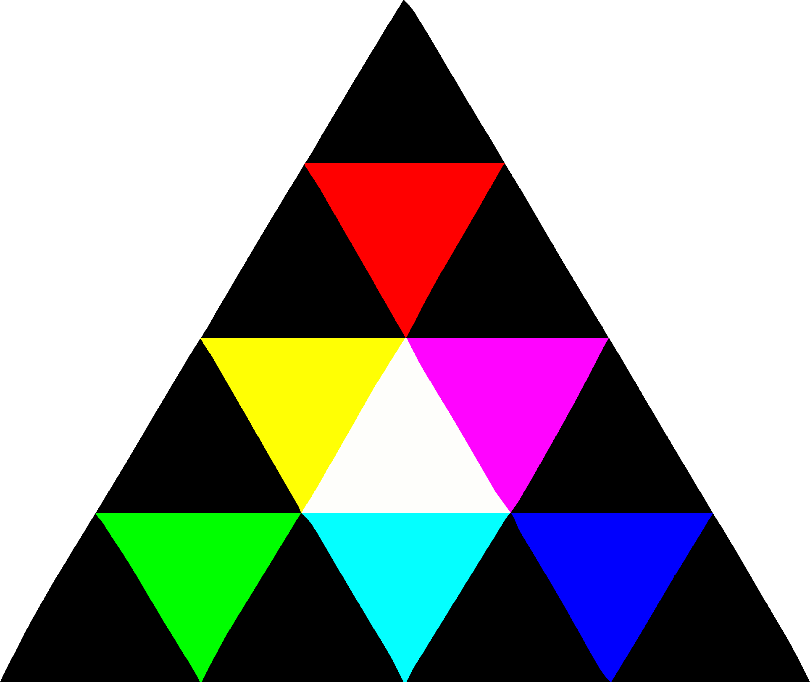

<p align="center">
    
</p>

<h1 align="center">Create</h1>

> Note: APIs are experimental and subject to change.

---

**Create** is a creative coding library for rapid prototyping and interactive graphics, inspired by Processing but built to scale — 
from sketch to game, prototype to full application. It provides a clean, modular API while taking full advantage of Mojo's performance and language features.

## Platforms

| Platform | Status |
|---|---|
| Linux (x86-64) | Supported, used day to day |
| Windows through WSL2 | Supported, used day to day |
| macOS on Apple silicon | Built and tested in CI on every change; little use on a real desktop yet |

Intel Macs and native Windows are not supported: Mojo doesn't run on either. Every dependency, Mojo included,
comes from [pixi](https://pixi.sh), so `pixi run` is all a supported machine needs. A program built with
`mojo build` finds those libraries itself, from any directory, while the pixi environment it was built in
stays where it is.

## The shape of a program

```mojo
from create import *


@fieldwise_init
struct MyApp(Program):
    @staticmethod
    def create(mut context: Context, mut canvas: Canvas) -> MyApp:
        # Called once: set initial application state and draw the first frame
        return MyApp()

    def update(mut self, mut context: Context, mut canvas: Canvas):
        # Called once per frame: handle input, modify state, and draw to the screen
        canvas.text("Hello World!", (0, 0))


def main() raises:
    run[MyApp]("Hello", WindowMode.WINDOWED)
```

Rendering runs on the CPU by default. `backend=RenderBackend.GPU` runs the same program through an OpenGL 3.3 backend instead:

```mojo
run[MyApp]("Example Sketch", backend=RenderBackend.GPU)
```

The example programs in this repository can be run with the `example` pixi task, which takes a name rather than a path. 
The name must correspond to a file or folder under `examples/`. For folders it will find an run their `src/main.mojo`.

```bash
pixi run example sketch          # examples/sketch.mojo
pixi run example sidescroller    # examples/sidescroller/src/main.mojo
pixi run example                 # lists every example
```

Benchmarks live under `benchmarks/` and run the same way with the `benchmark` task:

```bash
pixi run benchmark frame         # a heavy frame through the window loop, GPU
pixi run benchmark frame cpu     # the same frame on the CPU backend
pixi run benchmark raster        # CPU rasterisation per primitive, headless
```
